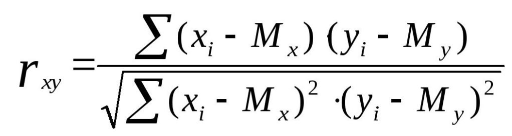

# Задание:
Написать скрипт для расчета корреляции Пирсона между
двумя случайными величинами (двумя массивами). Можете
использовать любую парадигму, но рекомендую использовать
функциональную, т.к. в этом примере она значительно
упростит вам жизнь.

Формула корреляции Пирсона:

## Комментарий к решению:
Использована функциональная парадигма:
реализация с помощью лямбда-функций и функции map.