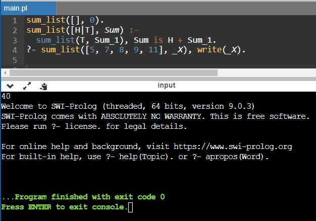

# Задание:
Написать программу на языке Prolog для вычисления суммы
элементов списка. На вход подаётся целочисленный массив.
На выходе - сумма элементов массива.

Задание выполнено в онлайн-компиляторе https://www.onlinegdb.com/online_prolog_compiler

Код:

    sum_list([], 0).
    sum_list([H|T], Sum) :-
        sum_list(T, Sum_1), Sum is H + Sum_1.
    ?- sum_list([5, 7, 8, 9, 11], _X), write(_X).

Скриншот результата:

